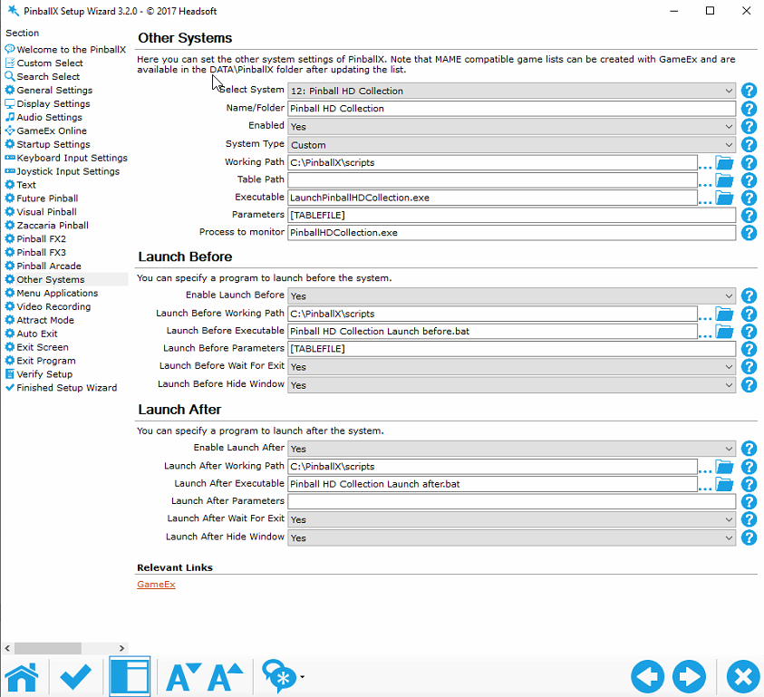
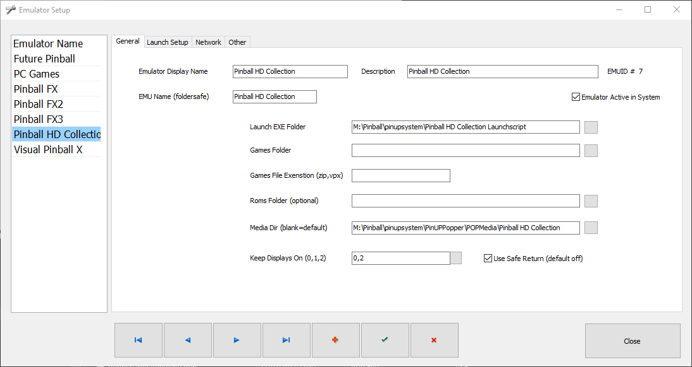

# Pinball HD Collection Launcher
[](https://github.com/joyrider3774/PinballHDCollectionLauncher/releases "Download Latest Version") 

A Launch Autohotkey script for pinball HD Collection that adds per table launching support. Plus a collection of media images like docklet wheels and backglass and Table videos that work with the script

## Help Videos

### Pinup Popper
[](https://youtu.be/GQxiCvGwmyY "Pinball HD Collection Launcher Pinup Popper Helper Video")

## Usage
Compile To Exe (check video above) then use these commands

```
LaunchPinballHDCollection.exe [TableName]
```

Where `[TableName]` is the name of the table

## Table Names
You can use any of the listed Table Name values below for the `[TableName]` Parameter

- arcade
- davinci
- deep
- dreamland
- fantasy
- halloween
- jungle
- mafia
- pirates
- redplanet
- snow
- streetracing
- tanks
- vikings
- wildwest
- zombie

## Getting Table Media from the game
Copy `create_assets_from_game.bat` from the media folder to the games installation folder where `PinballHDCollection.exe` is also located and run the batch file. It will create 2 wheel, audio and backglass folder where the media will be in which you can use.

## Cabinet setup pinball X

### Pinball X Settings 
compile the provided script to an EXE and make sure it's working then use these settings:


### Launch before & After script
You will need a launch before to run some program to rotate your screen to portrait mode. I personally use [irotate](https://www.entechtaiwan.com/util/irotate.shtm).

You will also need [dmdext](https://github.com/freezy/dmd-extensions/) to mirror the dmd display to the correct display

You will optionally also need my [Image monitor view](https://github.com/joyrider3774/Image_Monitor_View) program to display backglasses on the backglass monitor as rotating the screen sometimes has an effect on the positions from pinballx

You will optionally need ffplay.exe from [ffmpeg](https://ffmpeg.org/download.html) to play the topper videos on the topper display as pinballx and rotating the screen makes the videos stop from inside pinballx

Launch before (bat):
```
REM To Rotate screen
powershell -Command "Start-Process 'irotate.exe' '/2:rotate=90 /exit' -Verb runAs -WorkingDirectory 'C:\Program Files (x86)\iRotate\'"

REM To show picture on backglass
start Image_Monitor_View.exe 0 "C:\PinballX\Media\Pinball HD Collection\Backglass Images\%1.png"

REM To show topper video using ffplay
start "" "c:\pinballx\ffplay.exe" -left 2360 -top 0 -x 1920 -y 540 -alwaysontop -noborder -loop 0 "c:\PinballX\Media\Pinball HD Collection\Topper Videos\%1.mp4"

REM To mirror the DMD to DMD Display location
start "" /min dmdext.exe mirror --source=screen --position=220 0 640 128 --destination=virtual --virtual-stay-on-top --virtual-hide-grip --virtual-position=2360 540 1920 540 --virtual-dotsize=1.1
```

Launch After (bat):
```
taskkill /IM taskkill /IM Image_Monitor_View.exe
taskkill /IM dmdext.exe
taskkill /IM ffplay.exe
powershell -Command "Start-Process 'irotate.exe' '/2:rotate=0 /exit' -Verb runAs -WorkingDirectory 'C:\Program Files (x86)\iRotate\'"
```
## Cabinet setup Pinup Popper

### Popper Settings 
compile the provided script to an EXE and make sure it's working then add a new emulator using these settings and import the games from [exported game](https://raw.githubusercontent.com/joyrider3774/PinballHDCollectionLauncher/main/Databases/Popper/Export_Pinball%20HD%20Collection.pupgames) list i made (Use right click save as)

Also download Display.exe from this [zip file](https://www.nailbuster.com/uploads/PopperFXMirror.zip) made by NailBuster so you can rotate the screen. Extract this in `PinUPPopper\Launch` directory

You will also need [dmdext](https://github.com/freezy/dmd-extensions/) to mirror the dmd display to the correct display but its possible it already exists in your vpinmame directory

Table video's will need to be rotated as they were made for pinballx run `rotate table videos 180 degrees.bat` in media folder

Make sure to select to keep your backglass visible, i also enabled my topper to remain visible



### Launch Script
```
@echo off
REM This uses position for full hd it is possible you need to double the size in --position parameter when using 4k you also need to change --virtual-position positions to the location where you want to display thd dmd
start /min "" "c:\pinball\visualpinball\vpinmame\dmdext.exe" mirror --source=screen --position=220 0 640 128 --destination=virtual --virtual-stay-on-top --virtual-hide-grip --virtual-position=3840 540 1920 540 --virtual-dotsize=1.1
timeout 2

REM rotate screen
START /min "" "[STARTDIR]Launch\display.exe" /device 1 /rotate 90
timeout 2

REM Launch launcher
START "" "[DIREMU]\LaunchPinballHDCollection.exe" [GAMENAME]
timeout 5

REM popper detection of the window using VPXStarter
START "" "[STARTDIR]Launch\VPXSTARTER.exe" 5 5 60 "Pinball HD Collection"
```

### Close Script
```
START /min "" "[STARTDIR]Launch\display.exe" /device 1 /rotate 0
timeout 2

"[STARTDIR]LAUNCH\PUPCLOSER.EXE" WINTIT "Pinball HD Collection" 4 1
timeout 1

taskkill /f /im dmdext.exe
```

## Credits:
- System Logo i extracted from a backglass screenshot / promotional image
- Default System Backglass was a promotional image found on google
- Pinup popper playlist wheels i created based on the default wheel image template from Nailbuster as well as a playlist psd template by discord user Dondi and a promotional image from the game
